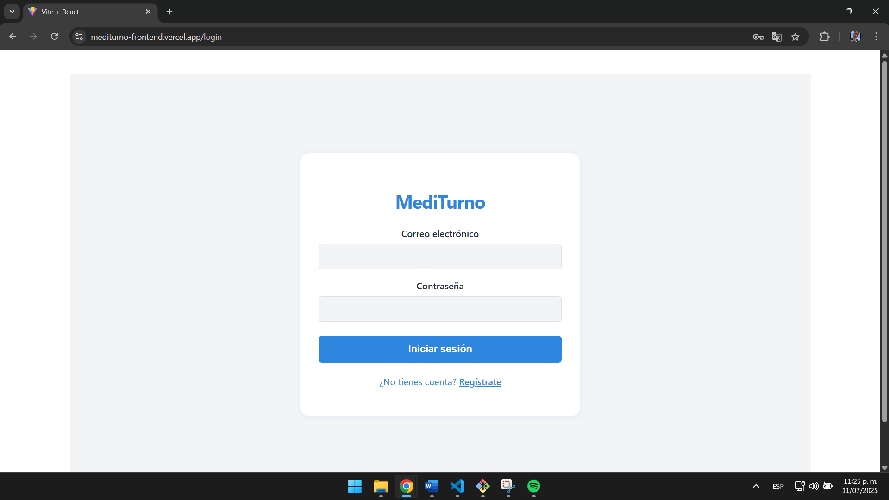
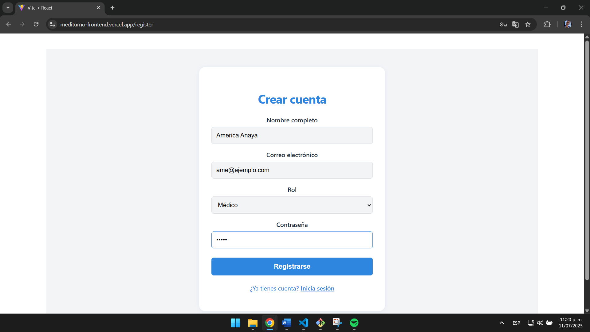
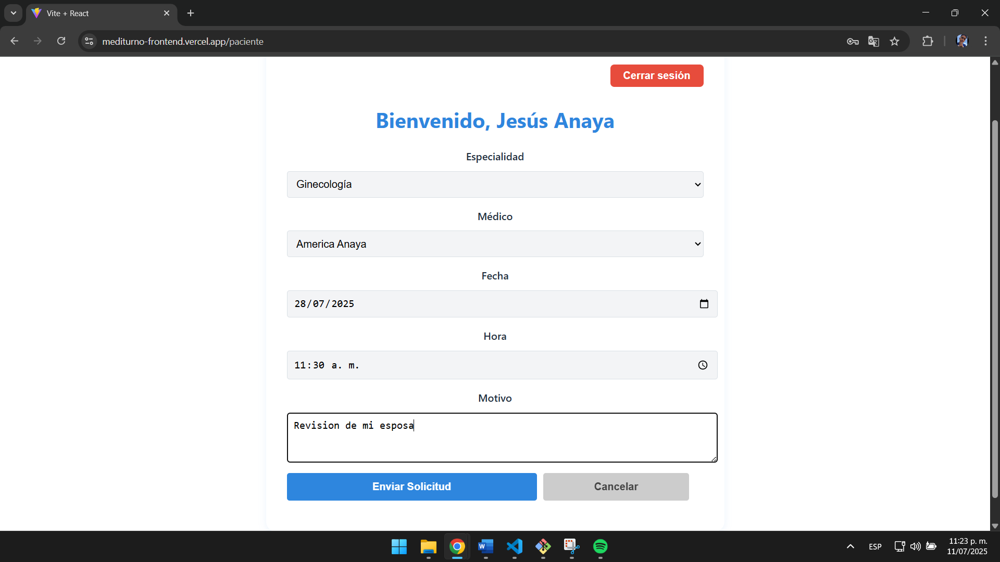
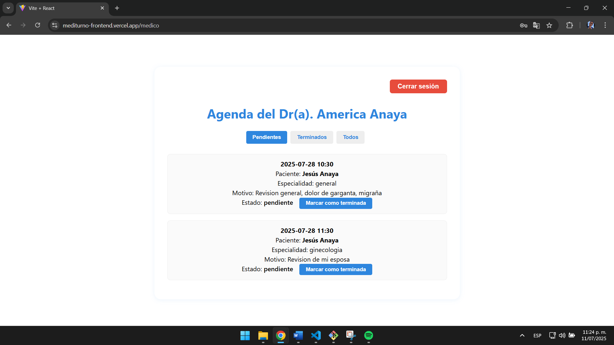

# 🩺 MediTurno - Frontend

Este repositorio contiene el **frontend** de MediTurno, una aplicación web para la gestión de turnos médicos desarrollada en **React**.

---

## 🚀 Demo en producción

* **App en línea:** [https://mediturno-frontend.vercel.app](https://mediturno-frontend.vercel.app)
* **Repositorio backend:** [https://github.com/JeesusA/mediturno-backend](https://github.com/JeesusA/mediturno-backend)
* **API backend:** [https://mediturno-backend.onrender.com](https://mediturno-backend.onrender.com)

---

## 📸 Capturas de pantalla

**Pantalla Login**

**Pantalla Register**

**Solicitar turno**

**Dashboard paciente**

**Dashboard medico**


---

## 🏗️ Estructura del proyecto

```
src/
├── assets/                 # Imágenes y logos
├── components/             # Componentes reutilizables
├── contexts/               # Contextos globales (AuthContext)
├── pages/                  # Páginas principales
│   ├── Login.jsx
│   ├── Login.module.css
│   ├── Register.jsx
│   ├── Register.module.css
│   ├── PacienteDashboard.jsx
│   ├── PacienteDashboard.module.css
│   ├── MedicoDashboard.jsx
│   ├── MedicoDashboard.module.css
├── App.jsx
├── main.jsx
```

---

## ⚙️ Instalación y configuración

1. **Clona el repositorio:**

   ```bash
   git clone https://github.com/tuusuario/mediturno-frontend.git
   cd mediturno-frontend
   ```

2. **Instala dependencias:**

   ```bash
   npm install
   ```

3. **Configura variables de entorno:**

   * Crea un archivo `.env` y coloca la URL real del backend:

     ```
     VITE_API_URL=https://mediturno-backend.onrender.com
     ```

4. **Ejecuta localmente:**

   ```bash
   npm run dev
   ```

---

## 🧩 Principales funcionalidades

* Registro y autenticación de usuarios (JWT)
* Gestión de turnos médicos para pacientes y médicos
* Filtros de turnos por estado
* Responsive design con CSS Modules
* Integración con backend Node/Express/MongoDB Atlas

---

## 👨‍💻 Tecnologías

* React
* Vite
* CSS Modules
* Axios
* React Router

---

## 📄 Licencia

MIT

---